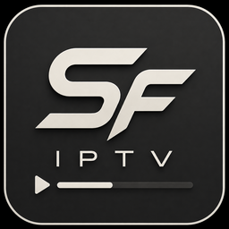
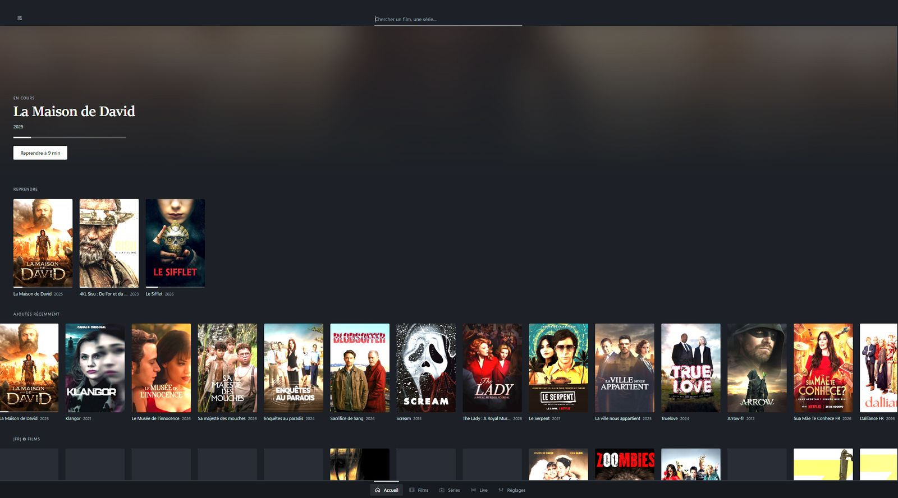
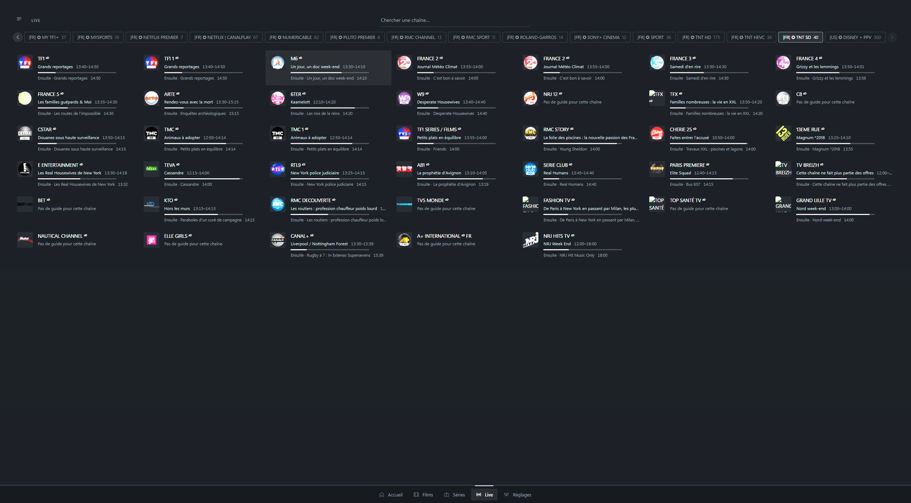

# SF IPTV

**Le lecteur IPTV qui range votre abonnement comme une vidéothèque.**

Gratuit pour PC Windows 10 et 11 · compatible Xtream et M3U

### [🌐 sfiptv.app](https://sfiptv.app) · [⬇️ Télécharger](https://github.com/Fyzzo/sfiptv-releases/releases/latest) · [📝 Notes de version](https://github.com/Fyzzo/sfiptv-releases/releases)

 

  

## Ce que fait SF IPTV

Des affiches à la place des listes interminables, une recherche qui trouve, et la reprise là où vous vous étiez arrêté. Vous entrez vos identifiants une fois, et vous n’y pensez plus.

- **Tout votre catalogue, rangé** : films, séries et chaînes récupérés puis classés tout seuls, mis à jour à l’ouverture, chaque jour, chaque semaine ou chaque mois.
- **Des titres enfin lisibles** : fini les noms à rallonge et les doublons ; les épisodes sont regroupés saison par saison.
- **Un guide des programmes** : vos chaînes en grille, heure par heure.
- **Une recherche qui trouve** : trois lettres suffisent.
- **Vos chaînes favorites** : le Live s’ouvre directement sur elles.
- **Reprise de lecture** pour chaque film et chaque épisode.
- **Code parental** : le contenu pour adultes reste masqué.
- **Lecture dans VLC**, fourni avec l’application : tout se lit tel quel, sans réglage.

  

## Installation

1. Téléchargez l’installeur `.exe` de la [dernière version](https://github.com/Fyzzo/sfiptv-releases/releases/latest).
2. Lancez-le. L’installation prend moins d’une minute.
3. Ouvrez SF IPTV et renseignez votre abonnement : **panel Xtream** (adresse, identifiant, mot de passe) ou **lien de playlist M3U**.

L’application se met ensuite à jour toute seule.

> [!NOTE]
> Au premier lancement, Windows peut afficher « Windows a protégé votre ordinateur ». C’est le message habituel pour une application récente et peu répandue, pas un virus : cliquez **Informations complémentaires**, puis **Exécuter quand même**.

## Ce que ce n’est pas

- **Aucun contenu fourni.** SF IPTV est un lecteur : pas de chaîne, pas de film, pas d’abonnement. Vous utilisez celui que vous avez déjà, et vous en restez responsable.
- **Aucun compte, aucune publicité.** Rien n’est envoyé à l’éditeur ; le mot de passe est rangé dans le gestionnaire d’identifiants de Windows.

## Soutenir le projet

SF IPTV est gratuit. S’il vous rend service, vous pouvez [offrir un café sur Ko-fi](https://ko-fi.com/sf7). C’est libre, et ça fait plaisir.

---

Ce dépôt ne contient pas le code de l’application : il héberge les installeurs publiés et le manifeste `latest.json` que la mise à jour automatique consulte. Questions et signalements : [ouvrir un ticket](https://github.com/Fyzzo/sfiptv-releases/issues).
